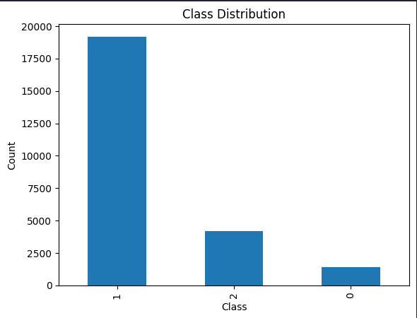
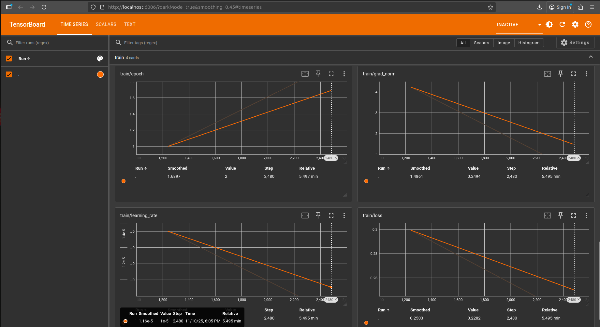
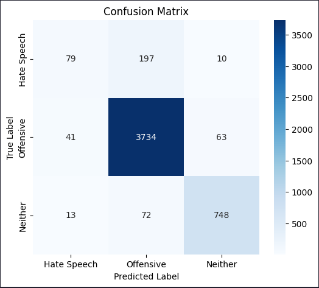

# NLP Transformers Fine-Tuning

This is an **NLP project** that fine-tunes a pretrained transformer model for **hate speech detection**, classifying tweets as **Hate Speech**, **Offensive**, or **Neither**. using Python and **Transformer models** (`vinai/bertweet-base` + Hugging Face Transformers).

---

## 🔹 Project Overview

This project demonstrates a complete NLP workflow:

1. Load and clean tweet data  
2. Tokenize text for transformer models  
3. Fine-tune a pretrained model (`vinai/bertweet-base`)  
4. Evaluate the model (accuracy, F1 score, confusion matrix)  
5. Save the trained model for later use

The goal is to create a **robust hate speech classifier** for tweets.

---

## 🔹 Dataset

The dataset contains **tweets** labeled for hate speech and offensive content, using the following columns:

- `tweet` → Tweet text  
- `class` → Label (`0 = Hate Speech`, `1 = Offensive`, `2 = Neither`)   

It can be seen from the image below that the classes are **imbalanced**, with most examples in class `1 = Offensive`:



Original dataset: [t-davidson/hate-speech-and-offensive-language](https://github.com/t-davidson/hate-speech-and-offensive-language)

---

## 🔹 Monitoring Training with TensorBoard

While training, you can monitor **loss curves, metrics, and more** using TensorBoard:

```sh
tensorboard --logdir=./logs
```
> Open http://localhost:6006/ in your browser to view training and evaluation metrics.   
> You can track training loss, evaluation loss, and any other metrics logged by your Trainer.

Here’s an example of how it looks:


---

## 🔹 Result

Here are the **training results** (example metrics on the test set):

- Accuracy: 0.92  
- Weighted F1 Score: 0.91  

**Confusion Matrix Example**:



> ⚠️ Note: From the confusion matrix, the model performs best on class `1 = Offensive`.  
> Classes `0 = Hate Speech` and `2 = Neither` are predicted less accurately because the dataset is **imbalanced**, with most examples belonging to the Offensive class. 